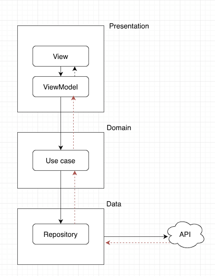

# FindFalcone

## Getting Started

To get the app up and running on your local machine, you need to have `cocoapods` installed:

```
gem install cocoapods -v 1.7.5
```

then install the dependencies by running:

```
pod install
```

Now you can open `FindFalcone.xcworkspace` in XCode and press "Command + R" to run the app, or "Command + U" to run unit tests.

## Design

The app uses 3 layer design as illustrated below - black arrow shows how the message is sent from one direction to another, and brown arrow shows how the data flows back:



The app is using RxSwift to deal with data streaming and asynchronised calls.

### Data

The data is provided by [Heroku API](https://findfalcone.herokuapp.com/). The app is using [Moya library](https://github.com/Moya/Moya) to do networking, and the data is cached in `DataStore`.

### Domain

The UseCases deal with business logic - initialising data, saving destinations, finding Falcone and restarting the game.

### Presentation

Presentation is where the UI logic sits. It consists of 2 parts:

View — responsible for presenting data and interacting with user inputs. It’s implemented using UIView and UIViewController

ViewModel — getting data from Domain and sending back to ViewController
